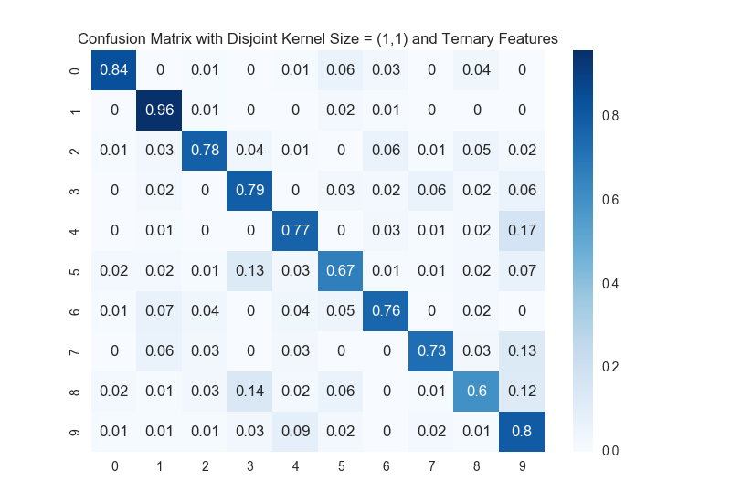

```{r setup, include = FALSE}
knitr::opts_chunk$set(echo = TRUE, warning = FALSE)
```

\newpage

# Part 1: Digit Classification

## Single Pixels as Features (For Everybody)

### Implementation

We treated this problem as a special case of *pixel group as features* where the pixel groups are simply disjoint and of size 1 by 1. Please see the next section for details (e.g choice of Laplace smoothing constant, classification rates, and confusion matrices).  

### Posterior Probabilities: Highest and Lowest

Test examples with largest and smallest posterior probabilities for each digit are shown below.  

```{r, echo = FALSE}
files <- list.files("img/prototypical/") 
for(file.name in files){
  path.to.file <- file.path("img/prototypical", file.name)
  file.con  <- file(path.to.file, open = "r")
  file.lines <- readLines(file.con)
  for(i in 1:length(file.lines)) {
    print(file.lines[i])
  }
  close(file.con)
}
```

### Visualization of Likelihoods and Odds Ratios

We interpreted `pairs of digits that have the highest confusion rates` as `pairs without misclassifications`. Hence, we chose pairs `(0, 9)`, `(1, 8)`, `(2, 5)`, and `(3, 4)` (randomly out of all eligible pairs). The plots are shown below. We tried several different color maps, but none of them match exactly with the example on the assignment page. The following are the closest version we can get. Though the color maps are different, they convey the same information. Also, note that the smoother used to generate these results will be described as a special case with disjoint kernel size `(1, 1)` in the next section.  

```{r, echo = FALSE, results = 'asis'}
files <- list.files("img/heatmap/")
for(file.name in files){
  path.to.file <- file.path("img/heatmap", file.name)
  pair <- substr(file.name, start = 9, stop = nchar(file.name)-4)
  caption <- paste("Heat Maps of Pair = ", pair, sep = "")
  cat(paste("{height=250px}", sep = ""), sep = "\n")
}
```


## Pixel Groups as Features (For Four-Credit Students)  
### Implementation

### Choice of Smoothing Constant: 10-Fold Cross Validation

We used 10-fold cross validation to select the smoothing constant. To be specific,   

* We randomly assigned a fold number (out of 1 to 10) to each record in the training set.   
* Then, we iterate through all potential smoothers on the each fold.   
* For a given smoother and a selected fold number, the selected fold will serve as the validation set and the remaining training set will be used to train the Naive Bayes model. We can calculate a performance measure (in this case: overall misclassification rate). Thus, we will get 10 measures for each smoother.  
* We summarized the performance of each smoother using the average of its 10 measures.  
* Finally, we selected the best smoother based on the aggregated averages.  
* **IMPORTANT NOTICE**: testing set is not being used in the entire cross validation phase. It is only used once for testing purposes. Relevant results (e.g. plots and prototypicals) are generated based on these tests.  

We considered smoothers in the list `smoothers = [0.1, 0.5, 1, 2, 4, 8]`. The best smoothers selected for different kernel sizes are shown below. The entire assignment used the same cross-validation methodology. Hence, we will not repeat this section again.   
```{r, echo = FALSE}
smoother.table <- 
  rbind(c("Disjoint"   , "(1, 1)", "0.5"), 
        c("Disjoint"   , "(2, 2)", "0.1"), 
        c("Disjoint"   , "(2, 4)", "0.1"), 
        c("Disjoint"   , "(4, 2)", "0.1"), 
        c("Disjoint"   , "(4, 4)", "0.1"), 
        c("Overlapping", "(2, 2)", "0.1"), 
        c("Overlapping", "(2, 4)", "0.1"), 
        c("Overlapping", "(4, 2)", "0.1"), 
        c("Overlapping", "(4, 4)", "0.1"), 
        c("Overlapping", "(2, 3)", "0.1"), 
        c("Overlapping", "(3, 2)", "0.1"), 
        c("Overlapping", "(3, 3)", "0.1"))
colnames(smoother.table) <- c("Kernel Type", "Kernel Size", "Best Smoother Value")
rownames(smoother.table) <- c()
knitr::kable(smoother.table, caption = "Choice of Smoothing Constant Using 10-Fold Cross Validation")
```


### Accuracy on Test Set: Classification Rate and Confusion Matrix  


```{r, echo = FALSE, results = 'asis'}
files <- list.files("img/conf_mat/")
for(file.name in files){
  path.to.file <- file.path("img/conf_mat", file.name)
  plot.type <- substr(file.name, start = 10, stop = 13)
  kernel.size <- substr(file.name, start = 14, stop = nchar(file.name)-4)
  caption <- paste(ifelse(plot.type == "disj", 
                          "Confusion Matrix with Disjoint Kernel Size = ", 
                          "Confusion Matrix with Overlapping Kernel Size = "), 
                   kernel.size, sep = "")
  cat(paste("{height=250px}", sep = ""), sep = "\n")
}
```


```{r, echo = FALSE}
accuracy.table <- 
  rbind(c("Disjoint"   , "(1, 1)", "77.0 %"), 
        c("Disjoint"   , "(2, 2)", "85.8 %"), 
        c("Disjoint"   , "(2, 4)", "88.6 %"), 
        c("Disjoint"   , "(4, 2)", "87.9 %"), 
        c("Disjoint"   , "(4, 4)", "84.6 %"), 
        c("Overlapping", "(2, 2)", "87.1 %"), 
        c("Overlapping", "(2, 4)", "89.6 %"), 
        c("Overlapping", "(4, 2)", "90.2 %"), 
        c("Overlapping", "(4, 4)", "87.4 %"), 
        c("Overlapping", "(2, 3)", "88.8 %"), 
        c("Overlapping", "(3, 2)", "90.0 %"), 
        c("Overlapping", "(3, 3)", "90.0 %"))
colnames(accuracy.table) <- c("Kernel Type", "Kernel Size", "Overall Accuracy")
rownames(accuracy.table) <- c()
knitr::kable(accuracy.table, caption = "Overall Accuracy on Different Kernels with Best Smoothers")
```

### Trends for Different Feature Sets
The following are some general trends we found,   

* with same kernel size, overlapping kernels tend to perform better than disjoint kernels because overlapping ones contain more features.  
* with the same kernel type, increase in kernel size does not necessary translate to better performance because at some point using additional features may be merely overfitting.  
* by trying out different kernels and tuning the smoother, one can achieve a much higher performance than merely using the default 1 by 1 pixels.  


### Running Time for Different Feature Sets

#### Training

#### Testing

## Extra Credit

### Ternary Features

This part is relatively easy. We merely changed the way we read in files to incorporate ternary features. Then, we run the same process as the one we used for binary features with disjoint 1 by 1 kernel. Finally, we ended up with the same best smoother (`= 0.5`) and the resulting overall classification rate is 77.1 %. There is not much improvements.    



### Naive Bayes Classifier on Face Data


---

# Part 2: Audio Classification

## Binary Classification: Hebrew Words of "Yes" and "No" (For Everybody)

### Implementation

### Classification Rate and Confusion Matrix

## Multi-Class Classification: Audio Digits 1-5 Spoken by Four Different Speakers (For Four-Credit Students)

### Implementation

### Overall Accuracy

### Classification Rate and Confusion Matrix

## Extra Credit

### Binary Classification on Unsegmented Data

### Alternative Method (RNN) on XXX Data

### Average-Column Method on Hebrew Yes-No Corpus


---

# Statement of Individual Contribution

```{r, echo = FALSE}
contribution_table <- 
  rbind(c("hcui10", "visualization, report, and ideas generation"), 
        c("gdou2", "part 1 (algorithm design and programming) and ideas generation"), 
        c("chuchao2", "part 2 (algorithm design and programming) and ideas generation"))
colnames(contribution_table) <- c("NetID", "Contribution")
rownames(contribution_table) <- c("Haoen CUI", "Guohao DOU", "Chuchao LUO")
knitr::kable(contribution_table, caption = "Statement of Individual Contribution")
```
